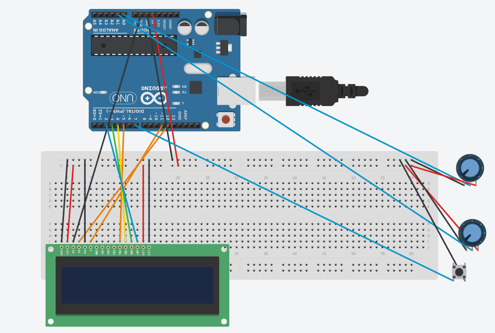

# Arduino 2-Axis Joystick Security Lock System

A responsive, microcontroller-based electronic security lock system built using an ATmega328P (Arduino Uno), a 16x2 character LCD, and a 2-axis analog joystick. The system handles real-time user input navigation, digit incrementing/decrementing, dynamic cursor positioning, and passcode validation.

---

## Project Demonstration

### Correct Passcode Entry (`1975`)

### Incorrect Passcode Entry

---

## System Features

* **Joystick Navigation:** Push left/right to move between digits, and up/down to change the numbers (0–9).
* **Push-Button Submit:** Pressing down on the joystick stick submits the PIN for verification.
* **4-Bit LCD Setup:** Wired directly to a standard 1602 LCD without needing extra I2C drivers.
* **Stable Loop Logic:** Uses a clean state loop instead of recursive function calls so the memory doesn't crash during long runs.

---

## Circuit Schematic

*The schematic shows the 4-bit LCD wiring (Pins 12, 11, 5, 4, 3, 2), contrast pot, and joystick logic (simulated via two potentiometers for VRx/VRy and a pushbutton for SW).*

---

## Future Improvements

* **Physical Servo Lock:** Connect a 5V servo motor to turn this from a display project into an actual physical vault mechanism with a functional latch.
* **Audio Feedback:** Hook up a piezo buzzer to play audio tones for button presses, access granted chimes, and wrong PIN alerts.
* **Status LEDs:** Add green and red LEDs to instantly show whether the system is locked or unlocked without reading the screen.
* **Passcode Storage:** Save user-defined passcodes to the onboard EEPROM so the PIN doesn't reset when unplugged.
